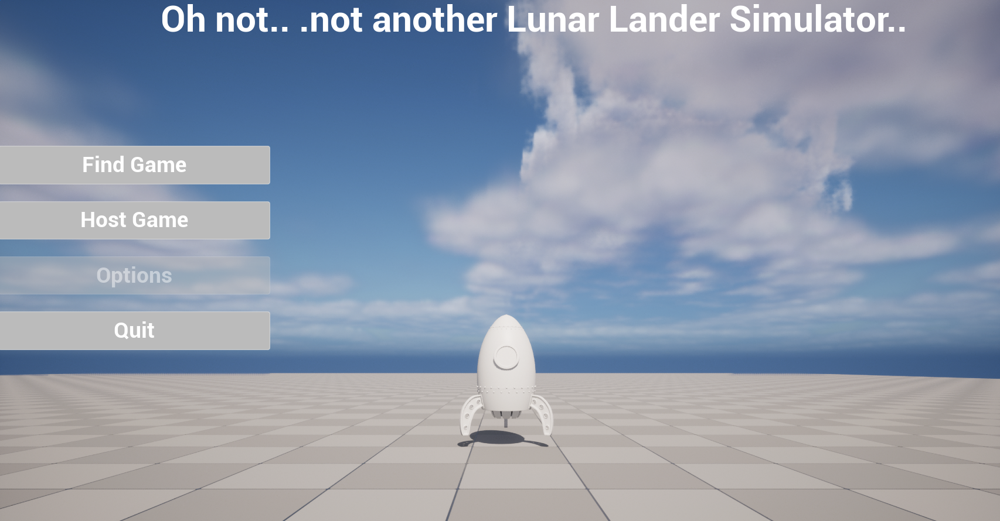
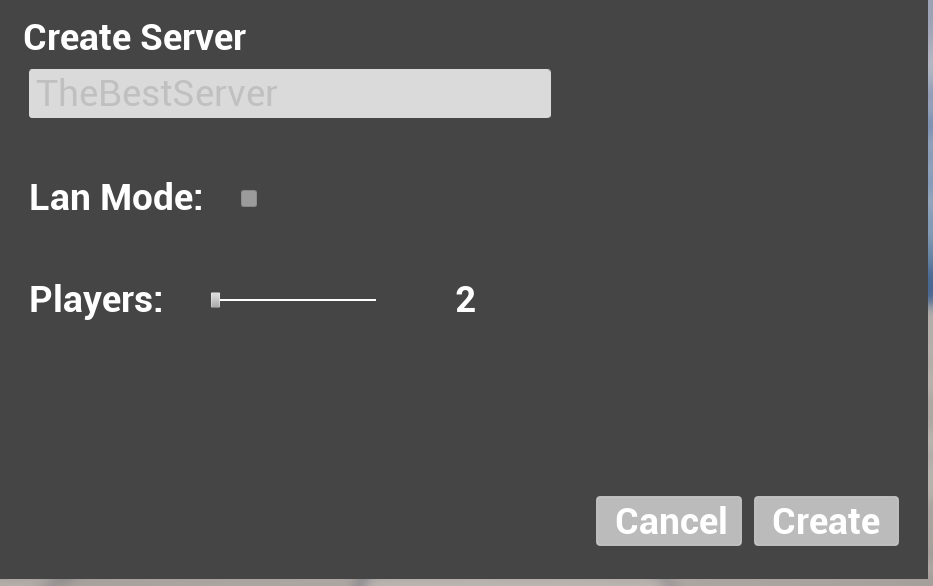
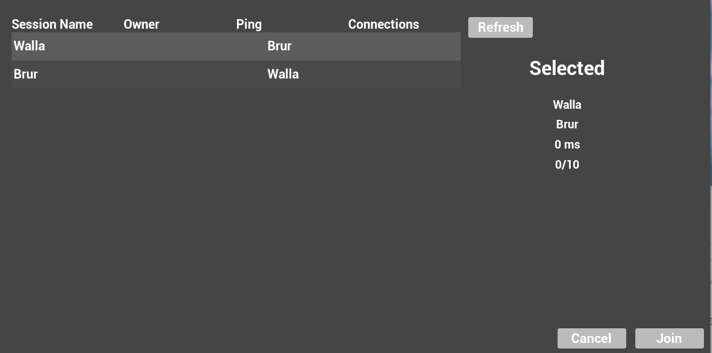
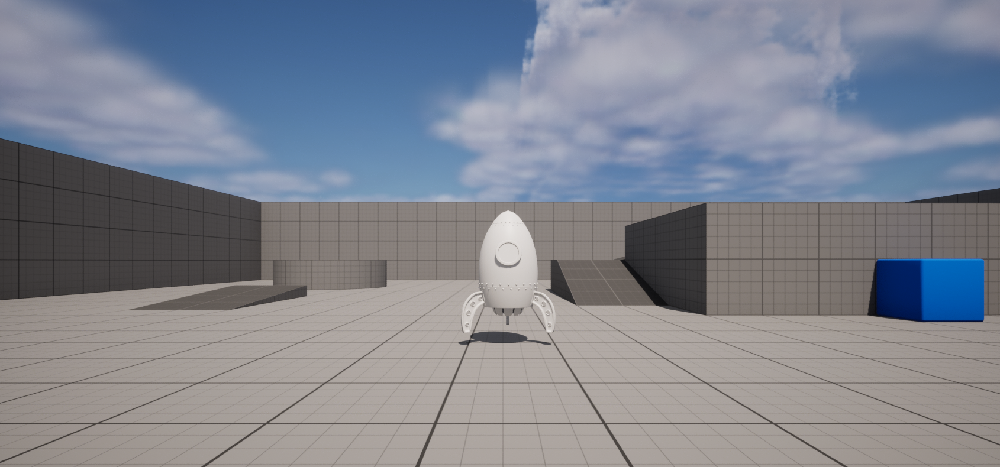

# Multiplayer Stylized Rocket Simulator
This project is a sandbox project for networked 6DoF lunar lander.
With some tweaks to the project it can be used for a space game, Drone simulator etc.   

The plan for this project is to evolve into a multiplayer lunar lander example.

# Overcome gimbal lock for 6DoF
~~In order to enable 6DoF we had to extend the base Character Movement Component for networked physics based movement.~~ 
  
So I actually found an easier solution which already replicates. If you have tried the third person example in unreal engine you know it replicates well.  

The addRotation functions eg. ```AddRollInput(float Val)``` already works for replication of rotation but suffers from gimbal-lock,   
reason is the use of euler rotation. To solve this override the function implementation in the Player Controller and replace the implementation with one Quaternion  delta rotation.

There will still be one more reason for gimbal-lock, the APlayerCameraManager. It also uses FRotator for rotation.  
Solved by creating a child class and overriding the following function with Quaternion based delta rotation:   
```virtual void ProcessViewRotation(float DeltaTime, FRotator& OutViewRotation, FRotator& OutDeltaRot) override;```.   

After this assign the camera manager to your Player Controller.

## Controls
Pitch and Roll Axis is controlled by A + D, W + S.   
Thrust is applied with space bar.   

When in game, pause menu can be reached with E key. - Its bound from Player Controller.

## Prequisites
Unreal Engine 5.1  
Steam

## ScreenShots


Main Menu.


Create Server Widget.


Find Server Widget.


In Game.
